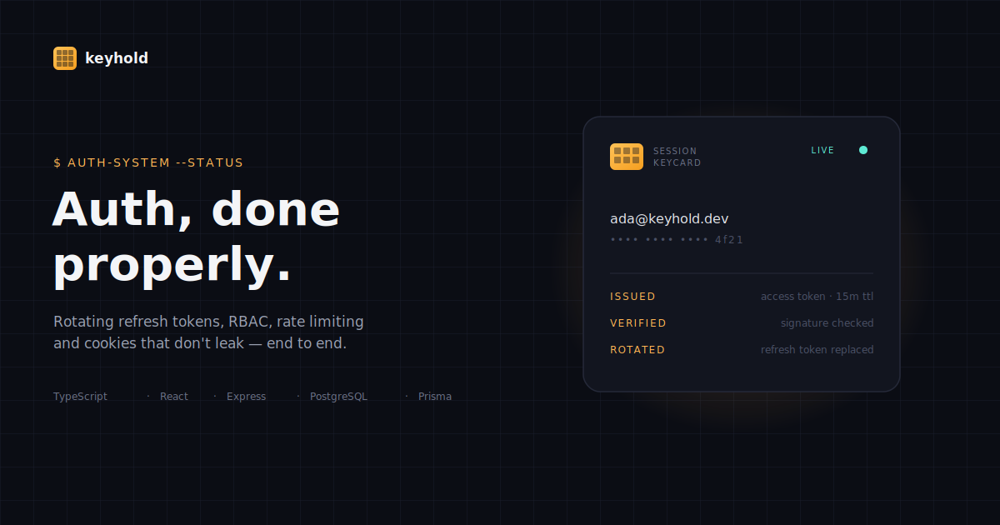

<div align="center">
  
</div>

<div align="center">

  <h3>A full-stack authentication system built the way a real one should be.</h3>
  <p>Rotating refresh tokens with reuse detection, role-based access control, rate limiting,<br/>and a login flow that doesn't fall over — implemented end to end, not stubbed out.</p>

  
  
  
  
  

</div>

<br/>

Most "auth starter" repos on GitHub are a login form wired to `localStorage`. **keyhold** is what the login form is supposed to be sitting on top of: a token lifecycle that can be revoked, a password path that can't be brute-forced quietly, and a session model that survives a stolen cookie. It's small enough to read in an afternoon and real enough to be worth reading.

---

## Contents

- [Features](#features)
- [Why it's built this way](#why-its-built-this-way)
- [Project structure](#project-structure)
- [Getting started](#getting-started)
- [Environment variables](#environment-variables)
- [API overview](#api-overview)
- [Tech stack](#tech-stack)

---

## Features

**Auth flows**
- Registration with a real password policy, enforced by Zod
- Login issuing a short-lived JWT access token and a rotating opaque refresh token
- Silent token refresh — the client retries a failed request after quietly refreshing in the background, so the user never sees a 401
- Logout that actually revokes the refresh token server-side, not just a client-side redirect
- Forgot / reset password (email delivery simulated — the link is logged to the server console, so the whole flow is testable without an SMTP account)
- Change password while signed in, which revokes every other active session
- Account lockout after 5 failed login attempts

**Authorization**
- Protected routes on both sides: `ProtectedRoute` in React, `requireAuth` in Express — neither trusts the other
- Role-based access control (`USER` / `ADMIN`), enforced again on both ends (`AdminRoute`, `requireRole`)

**Security**
- Passwords hashed with **argon2id** (OWASP's current recommendation)
- Refresh tokens stored **hashed**, never in plaintext — a database leak doesn't hand out sessions
- Refresh token **rotation with reuse detection**: replaying a used token revokes the entire session family, not just that token
- Access token kept in memory only; refresh token in an `HttpOnly`, `SameSite` cookie scoped to `/api/auth` — an XSS payload can't read either one
- `helmet` security headers, a strict CORS allow-list, a small JSON body limit
- Rate limiting on every auth endpoint
- One error handler, and it never leaks a stack trace or a database error to the client
- Password reset returns the identical response whether or not the email exists — no account enumeration

**Built to be read**
- TypeScript, strict mode, both ends
- Swagger / OpenAPI docs served live at `/api/docs`
- Unit tests co-located with the code they test
- One `docker compose up` boots Postgres, the API, and the SPA together
- Dark mode, and a UI that isn't a stock component library demo

---

## Why it's built this way

**Access token *and* refresh token, not just one JWT.**
A single long-lived JWT can't be revoked before it expires — that's the tradeoff for being stateless. Splitting the session into a short-lived (15 min) stateless access token and a long-lived, database-backed refresh token gets both properties: fast, no-database-hit checks on every request, and the ability to kill a session immediately on logout, password change, or suspected theft.

**Refresh tokens rotate, and reuse is treated as an incident.**
Every refresh swaps the token for a new one and revokes the old one. If a *revoked* token ever shows up again, that's not a bug — it's a stolen token being used after the legitimate client already rotated past it. The server responds by revoking the entire session family for that user, not just the one token.

**The access token never touches `localStorage`.**
`localStorage` is readable by any script on the page, so one XSS bug anywhere — including in a dependency — can exfiltrate every session. The access token lives in a JS variable, gone on reload; the refresh token lives in an `HttpOnly` cookie neither reads.

```
┌────────┐   login/register    ┌────────┐   argon2id hash    ┌────────────┐
│ Client │ ───────────────────▶│  API   │ ──────────────────▶│  Postgres  │
└────────┘                     └────────┘                     └────────────┘
     │        access token (memory)  +  refresh token (HttpOnly cookie)
     │◀──────────────────────────────────────────────────────────────────
     │
     │  access token expires → silent /auth/refresh → rotate + reissue
     │──────────────────────────────────────────────────────────────────▶
     │
     │  reused/revoked token presented → entire session family revoked
     ▼
```

---

## Project structure

Both apps are organized **by feature**, not by file type — `auth` owns its controller, service, routes, and validators in one place instead of scattering them across four top-level folders.

```
keyhold/
├── backend/
│   ├── prisma/
│   │   └── schema.prisma          # User, RefreshToken, PasswordResetToken
│   └── src/
│       ├── modules/
│       │   ├── auth/               # everything auth: controller, service,
│       │   │   ├── auth.controller.ts     routes, validators, password &
│       │   │   ├── auth.service.ts        token services, co-located tests
│       │   │   ├── auth.routes.ts
│       │   │   ├── auth.validators.ts
│       │   │   ├── password.service.ts
│       │   │   ├── token.service.ts
│       │   │   ├── refreshToken.service.ts
│       │   │   └── *.test.ts
│       │   └── users/              # admin-only user listing (RBAC demo)
│       ├── middleware/             # requireAuth, requireRole, rateLimit,
│       │                             validate, errorHandler
│       ├── config/                 # env validation, Prisma client, OpenAPI spec
│       ├── utils/                  # AppError, cookies, hashing, catchAsync
│       ├── app.ts
│       └── server.ts
│
├── frontend/
│   └── src/
│       ├── features/
│       │   ├── auth/                # AuthContext, auth.service, pages
│       │   │   ├── AuthContext.tsx    (Login/Register/Forgot/Reset), and the
│       │   │   ├── auth.service.ts    ProtectedRoute / AdminRoute guards
│       │   │   ├── pages/
│       │   │   └── components/
│       │   ├── dashboard/
│       │   └── admin/
│       ├── components/
│       │   ├── ui/                  # Alert, FormField, Spinner, Reveal, icons
│       │   ├── layout/              # Navbar, Layout, ThemeToggle
│       │   └── marketing/           # KeycardPanel (the landing hero visual)
│       ├── lib/api.ts                # axios client + silent-refresh interceptor
│       ├── context/ThemeContext.tsx
│       ├── hooks/useScrollReveal.ts
│       └── pages/                    # Landing, NotFound
│
├── docs/banner.svg
└── docker-compose.yml
```

---

## Getting started

### Option A — Docker (fastest)

```bash
docker compose up --build
```

- Frontend → http://localhost:5173
- API → http://localhost:4000/api
- Swagger docs → http://localhost:4000/api/docs

The backend container runs `prisma migrate deploy` automatically on startup.

### Option B — Run it locally

**Prerequisites:** Node.js 20+, PostgreSQL (or `docker compose up postgres` for just the database).

```bash
# Backend
cd backend
cp .env.example .env      # fill in real secrets — see below
npm install
npm run prisma:migrate    # creates the tables
npm run dev                # → http://localhost:4000
```

```bash
# Frontend, in a second terminal
cd frontend
cp .env.example .env
npm install
npm run dev                # → http://localhost:5173
```

### Running the tests

```bash
cd backend
npm test
```

---

## Environment variables

See `backend/.env.example` and `frontend/.env.example` for the full list. The ones that matter most:

| Variable | Description |
|---|---|
| `DATABASE_URL` | PostgreSQL connection string |
| `JWT_ACCESS_SECRET` / `JWT_REFRESH_SECRET` | Random secrets — `openssl rand -base64 64`. Never reuse across environments. |
| `JWT_ACCESS_EXPIRES_IN` / `JWT_REFRESH_EXPIRES_IN` | Token lifetimes (default `15m` / `30d`) |
| `COOKIE_SECRET` | Used to sign cookies |
| `CLIENT_URL` | The one origin CORS will allow |
| `AUTH_RATE_LIMIT_MAX` / `_WINDOW_MIN` | Throttle for auth endpoints |

---

## API overview

Full interactive docs live at `GET /api/docs` (Swagger UI). Summary:

| Method | Endpoint | Auth | Description |
|---|---|---|---|
| POST | `/api/auth/register` | – | Create an account, start a session |
| POST | `/api/auth/login` | – | Log in, start a session |
| POST | `/api/auth/refresh` | refresh cookie | Rotate the refresh token, issue a new access token |
| POST | `/api/auth/logout` | refresh cookie | Revoke the refresh token, clear cookies |
| GET | `/api/auth/me` | access token | Get the current user |
| POST | `/api/auth/forgot-password` | – | Request a reset link (simulated email) |
| POST | `/api/auth/reset-password` | – | Reset the password with a valid token |
| POST | `/api/auth/change-password` | access token | Change password, revokes every other session |
| GET | `/api/users` | access token, **ADMIN** | List all users |

Validation errors return `400` with a `details` array of `{ field, message }`.

---

## Tech stack

**Backend** — Node.js · Express · TypeScript · Prisma · PostgreSQL · Zod · argon2 · JWT
**Frontend** — React · TypeScript · Vite · Tailwind CSS · React Router · Axios
**Infra** — Docker · docker-compose · Swagger/OpenAPI · Vitest

---

## License

MIT — use it, fork it, put it on your résumé.
